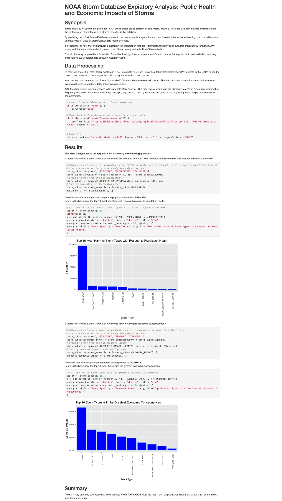

# Reproducible Research Project 2

This repository contains the code and data for the Reproducible Research
Project 2. The project focuses on analyzing and visualizing data using R.

## Project Overview

The goal of this project is to explore a dataset and perform various data
analysis tasks using R. The dataset used in this project is [insert dataset
name]. The project includes the following tasks:

1. Data preprocessing and cleaning
2. Exploratory data analysis
3. Statistical modeling
4. Data visualization

Final output of the project is a report that is published on RPubs
(https://rpubs.com/ChrisSYang/1140761)

Below is the snapshot of the final output:

## Getting Started

To get started with this project, follow the steps below:

1. Clone this repository to your local machine.
2. Install the required dependencies and packages.
3. Open `noaa_data.Rmd` R Markdown file and run the code to reproduce the
   analysis.

## Project Structure

The project is organized as follows:

-   `data/`: Contains the dataset to be downloaded for data analysis. The R
    Markdown file includes process to download the source data if it does not
    exist in the `data/` directory
-   `noaa_analysis.Rmd`: R Markdown file containing the code for data analysis
-   `noaa_analysis.html`: HTML file containing the output of the R Markdown file
-   `noaa_analysis.jpeg`: JPEG file containing the image of the R Markdown file

## Dependencies

The following dependencies are required to run the code:

-   R version 4.3.0 or higher
-   ggpot2 version 3.3.3 or higher
